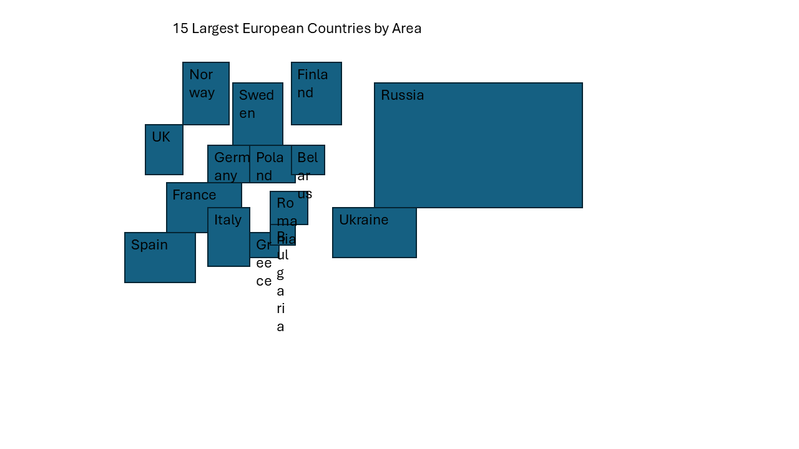

# aigency
repo for learning AI agents and MCP

# Use Cases

## Office (PowerPoint, Excel) Automation

### Claude & PowerPoint-MCP-Server
This is a Windows-based workflow, since we're using Python's Windows integration, so we're going to use PowerShell.

For my demo, I used an existing repo, already defining MCP-Servers for an included service using pywin to manipulate your running PowerPoint application: https://github.com/jenstangen1/pptx-xlsx-mcp

In this demo, we want to instruct an agent to do the following:
- make a new slide
- add a rectangle (circles not supported in this demo) for each of the 15 largest countries of Europe, where:
    - the size is based on the countries' area
    - the center position is based on the most central position of the country
    - a label/text box is added with the country's name

#### Installation

First, you need to install [Claude Desktop App](https://claude.ai/download), which brings Claude (hosted through Anthropic) and the capability to configure MCP-Endpoints

Once, we have installed Claude, we can prepare our Endpoint, for this we need a common Python setup including:
- some Python, I would recommend 3.11 or 3.12, including
- pip
- venv

We're using two git repos here, so we have two project folders, that each need to be referenced throughout. So we're referencing these locations with `<AIGENCY>` for this repo and `<MCP-SERVER>`for the backend we're using, when specifying paths in this guide. You need to replace these tags respectively. 

After cloning this repository, also clone our dependency in another location (not inside `aigency` project):

```shell
git clone https://github.com/jenstangen1/pptx-xlsx-mcp.git
cd pptx-xlsx-mcp
```

Now we need to install the environment:
```powershell
# creating environment
python -m venv .venv

# activating environment
.\.venv\Scripts\Activate.ps1

# installing dependencies - important, we're using our own requirements.txt file
pip install -r <AIGENCY>\demo1_requirements.txt
```

After that, we need to run a script with Admin privileges, so open an Admin PowerShell instance to run:
```powershell
python .venv\Scripts\pywin32_postinstall.py -install
```

>[!TIP]
>if your PowerShell prohibits execution of scripts, you can open a console instance from PowerShell that bypasses this rule:
>```powershell
>powershell -ExecutionPolicy ByPass
>```

#### Integrating with Claude
Open and first operate the Claude Desktop App, so you can access the main window. 

On the top left, hit the hamburger menu button (the three lines), -> **File** -> **Settings...**

Open the tab ``Developer`` and click `Edit Config`. A file explorer window opens, and now open to edit the `claude_desktop_config.json` and insert following content.

```json
{
    "mcpServers": {
        "powerpoint_mcp_win32": {
            "command": "<MCP-SERVER>\\.venv\\Scripts\\python.exe",
            "args": [
                "<MCP-SERVER>\\mcp_powerpoint_server_win32.py"
            ]
        }
    }
}
```

>[!TIP]
>when writing out paths in a JSON (to configure Claude), use escaped backslashes (just add another backslash to each backslash), as seen in this snippet. Otherwise paths will not be interpretable along their way

Now, restart Claude (full quit, not just closing window). You should now see a hammer symbol right below the prompt, with a number next to it. When clicking on it, you can see the MCP-Methods that were sourced from our endpoint - indicating that things worked out so far.

#### Let's roll
Now, we want to excersize a common office workflow, so we're of course actively working in PowerPoint on a file. While having a window open, we can now tell Claude to do stuff for us in PowerPoint.

If you instruct Claude to add shapes as in this Demo's concept above, you can - over a course of 2 minutes - watch your PowerPoint slide being populated in real-time. 

See, if you can recreate this (archaic) result - with no manual action at all:

